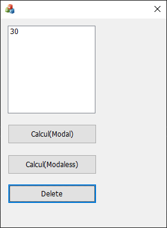

# Modal과 Modaless Dialog 띄우기. (2019_10_30)

------------------------------------------------------------------------------------------------------------

첫 화면입니다.
Calcul(Modal) 버튼을 누를 경우 Modal Dialog가 실행이 되고
Calcul(Modaless) 버튼을 누를 경우 Modaless Dialog가 실행이 됩니다.

저는 기본적으로 사칙연산 계산기를 구현하였습니다.

Calcul(Modal)로 실행한 화면입니다.
피연산자 5와 6을
연산자 더하기와 곱하기를 실행한 모습입니다.
CSonDlg에 EditControl 두개를 변수로 추가하고
버튼 클릭 시 임의의 변수 m_c = m_a (?) m_b; 하여
연산 값을 m_c에 담습니다. 이후 string 으로 타입 캐스팅하고
ListBox에 추가하는 방식으로 했습니다.

Calcul(Modaless)로 실행한 화면입니다.
Modaless로 실행했기 때문에 띄워진 창이 종료가 되지 않아도 바깥 작업을 수행할 수 있기 때문에
Dialog 창을 하나 더 띄워보았습니다.

Delete 기능을 넣어 ListBox 에 있던 값 11을 지워보았습니다.
GetCurSel() 함수를 이용하여 선택한 값의 인덱스를 받아 
DeleteString(index) 함수로 그 인덱스의 라인을 지웠습니다. 

------------------------------------------------------------------------------------------------------------

Dialog 창을 하나 더 생상하고 그 Dialog 창을 기존 창에서 띄우게 해 보았습니다.

각각의 dialog 창에서 값들을 불러오고 저장하는게 굉장히 흥미로웠습니다.

예전에 학습한 내용들을 떠올려 결합해보니 괜찮은 결과물이 나온 것 같습니다.

여러 기능들을 추가하면 합으로 연산되는것이 아닌 곱으로 연산이되어

몇 배로 좋은 아웃풋이 나오는 것 같아 정말 뿌듯합니다. 사랑합니다!!
